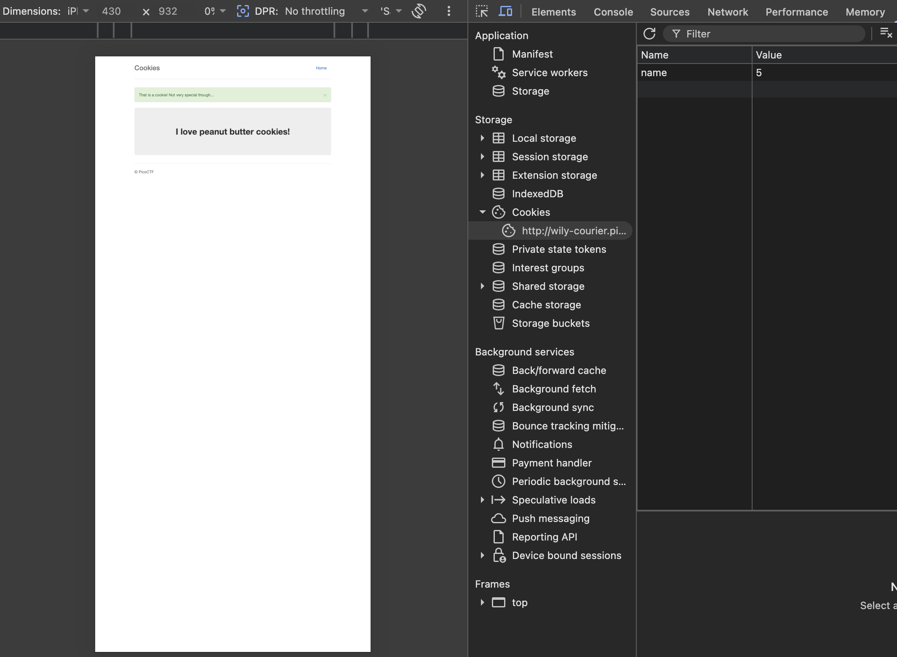
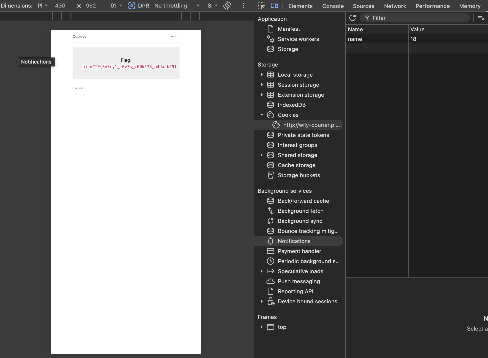
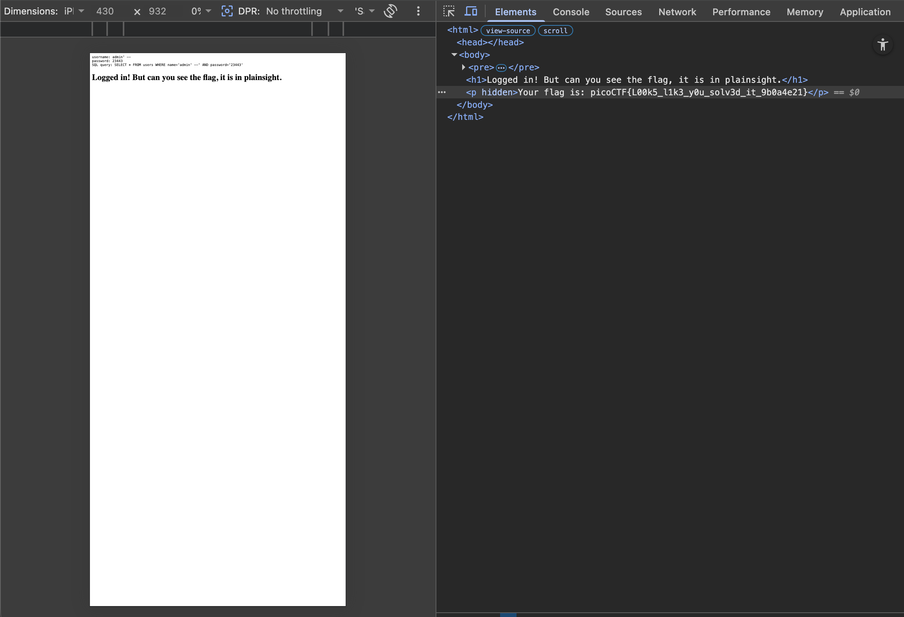
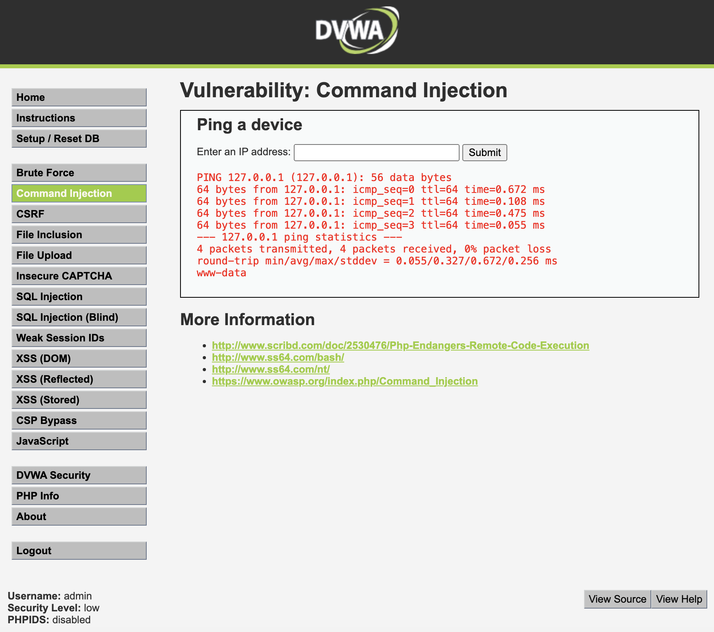
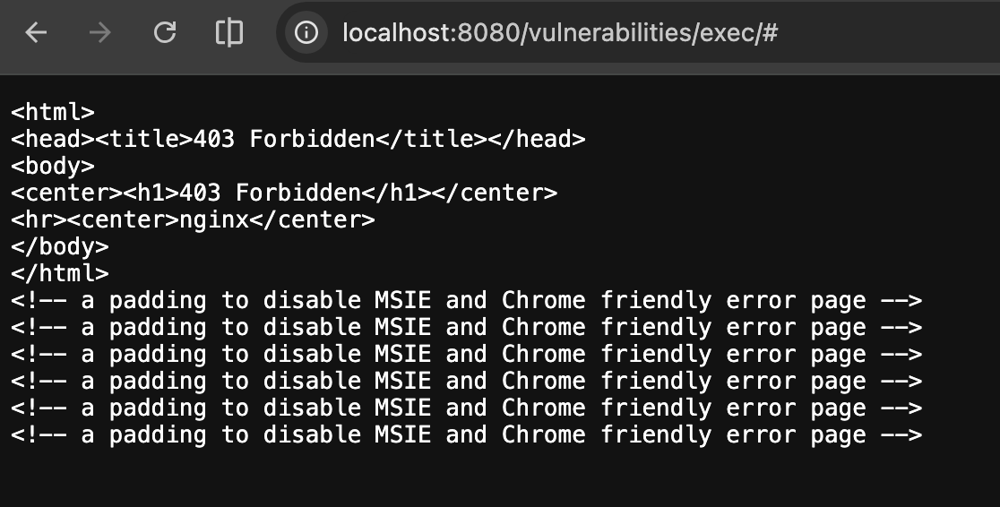

# Homework 3: Web Defense & Privacy Compliance
**Estudiante:** Jarod Tierra  
**Fecha:** 2026-05-01

---

## 1. OWASP & CWE Mapping

Se seleccionaron tres categorías del OWASP Top 10 (edición 2021):

| OWASP Category | CWE | CVE | Impacto (2 oraciones) |
|---|---|---|---|
| **A03 – Injection** | CWE-89: SQL Injection | CVE-2023-48788 (FortiClientEMS) | Un atacante no autenticado podía enviar peticiones SQL maliciosas al componente de sincronización de clientes, logrando ejecución remota de código con privilegios SYSTEM en el servidor. El fallo afectó a miles de organizaciones que usaban FortiClientEMS ≤ 7.2.2, con un CVSS de 9.8 (Crítico). |
| **A02 – Cryptographic Failures** | CWE-327: Use of Broken Algorithm | CVE-2025-24054 (Windows NTLM Hash Disclosure) | Windows permitía que un archivo `.library-ms` malicioso provocara la filtración automática del hash NTLM del usuario al ser procesado por el Explorador, exponiendo credenciales en tránsito de red. El hash NTLM capturado podía ser crackeado offline o reutilizado en ataques pass-the-hash para comprometer cuentas de dominio. |
| **A07 – Identification & Authentication Failures** | CWE-306: Missing Authentication for Critical Function | CVE-2026-41940 (cPanel & WHM) | cPanel exponía una función crítica de administración sin requerir autenticación, permitiendo a cualquier usuario de red ejecutar acciones privilegiadas con un CVSS de 9.3. El acceso no autorizado permitía modificar configuraciones del servidor web, instalar software malicioso o elevar privilegios dentro del sistema de hosting. |
---

## 2. The Ecuadorian Context: LOPDP

### Los Ocho Derechos del Titular (Art. 9, LOPDP)

La **Ley Orgánica de Protección de Datos Personales** (R.O. Suplemento 459, 26 de mayo de 2021) reconoce ocho derechos a los titulares de datos:

| # | Derecho | Descripción |
|---|---|---|
| 1 | **Acceso** | El titular puede obtener gratuitamente información sobre sus datos tratados, dentro de un plazo de 15 días hábiles. |
| 2 | **Rectificación** | Corrección de datos inexactos, incompletos o desactualizados. |
| 3 | **Eliminación / Cancelación** | Supresión permanente y segura de datos cuando ya no son necesarios o el consentimiento fue revocado. |
| 4 | **Oposición** | El titular puede oponerse al tratamiento cuando la ley lo permita (p. ej., tratamiento con base en interés legítimo). |
| 5 | **Suspensión del tratamiento** | Bloqueo temporal del tratamiento mientras se resuelve una disputa sobre la licitud del mismo. |
| 6 | **Portabilidad** | Recibir los datos en formato estructurado, de uso común y lectura mecánica, y transmitirlos a otro responsable. |
| 7 | **No ser objeto de decisiones automatizadas** | No estar sujeto exclusivamente a decisiones automatizadas —incluida la elaboración de perfiles— que produzcan efectos jurídicos significativos. |
| 8 | **Educación digital** | Derecho a recibir información y formación sobre el uso seguro de sus datos personales y el ejercicio de sus derechos. |

### Comparativa de Enforcement: Superintendencia vs. GDPR (AEPD/DPC)

| Dimensión | Ecuador (Superintendencia de Protección de Datos) | UE (GDPR – Autoridades nacionales) |
|---|---|---|
| **Órgano regulador** | Superintendencia de Protección de Datos (SPD), creada por la LOPDP | Autoridades de Control nacionales (AEPD, CNIL, DPC, etc.) coordinadas por el EDPB |
| **Sanciones máximas** | 0.1 % – 1 % de los ingresos anuales del responsable (*leve → muy grave*) | Hasta 20 millones de EUR o **4 %** de la facturación global anual (lo que sea mayor) |
| **Notificación de brecha** | 5 días hábiles a la Superintendencia | 72 horas a la autoridad de control |
| **Transferencias internacionales** | Requieren garantías adecuadas (países con nivel adecuado o cláusulas contractuales) | Sistema de decisiones de adecuación + SCCs + BCRs, gestionado por Comisión Europea |
| **Caso de enforcement real** | LigaPro (2025): multa de USD 259 000 por tratamiento sin consentimiento válido en datos de aficionados | Meta (Irlanda, 2023): multa de 1 200 millones EUR por transferencias a EE.UU. |
| **Diferencia clave** | Régimen más joven, sanciones económicas menores, pero con plazos de notificación más estrictos (5 vs. 72 h). La SPD aún está consolidando su capacidad institucional. | Marco maduro, fuertes poderes de investigación, mecanismo de ventanilla única para grupos multinacionales. |

---

## 3. Hands-on Exploitation & Defense: picoCTF


---

### Reto 1: **Cookies** (picoCTF 2021)

**Categoría:** Web Exploitation  
**Dificultad:** Fácil

#### Descripción del reto
La aplicación web presenta un buscador de tipos de galletas. El objetivo es encontrar la flag manipulando las cookies HTTP del navegador.

#### Proceso de análisis y deducción

**Paso 1 — Reconocimiento inicial**

Al cargar la aplicación por primera vez, se abre DevTools (`F12 → Application → Cookies`) y se observa que el servidor establece automáticamente:

```
Cookie: name = -1
```

El valor `-1` no es un nombre de galleta — es un **centinela numérico** que indica "ninguna seleccionada". Esto revela que el servidor usa enteros para identificar las cookies, no cadenas de texto.

**Paso 2 — Confirmación del patrón con la primera búsqueda**

Se escribe `snickerdoodle` (el texto placeholder del formulario) y se hace clic en Search. La cookie cambia a:

```
Cookie: name = 0
```

Esto confirma que el servidor asigna un **índice entero secuencial** a cada tipo de galleta. Si existe el índice `0`, deben existir `1`, `2`, `3`... La pregunta es cuántos hay y si alguno es "especial".

**Paso 3 — Enumeración incremental**

Con este patrón identificado, la estrategia es recorrer los índices de forma ordenada — no aleatoria — desde `0` hacia arriba, modificando la cookie en DevTools en cada intento y visitando el endpoint `/check`, que es donde el servidor evalúa el valor:

| Cookie `name` | Respuesta del servidor |
|---|---|
| 0 | "I like snickerdoodle cookies!" |
| 1 | "I like chocolate chip cookies!" |
| ... | ... (respuesta normal para cada galleta) |
| **18** | **Flag: `picoCTF{3v3ry1_l0v3s_c00k135_a4dadb49}`** |

El índice **18** devuelve una respuesta completamente diferente: la flag. Esto indica que es un valor oculto que no aparece en el formulario y al que solo se puede llegar manipulando la cookie directamente.

**Pasos en el navegador:**
1. Abrir DevTools → Application → Cookies
2. Cambiar el valor de la cookie `name` de `0` a `18`
3. Navegar a `http://wily-courier.picoctf.net:52905/check`
4. La flag aparece en pantalla

**Proceso de enumeración** — cookie `name=5` devuelve una respuesta normal:


**Cookie `name=18` en DevTools y flag obtenida:**


**Flag obtenida:** `picoCTF{3v3ry1_l0v3s_c00k135_a4dadb49}`

#### Lección de seguridad
El servidor tomaba decisiones basándose en un valor numérico enviado por el cliente sin ninguna validación ni firma criptográfica. Esto es **Client-Side Trust** (CWE-565): al no existir control del lado del servidor, cualquier usuario puede acceder a recursos arbitrarios simplemente cambiando un número. La defensa correcta es manejar el estado de sesión íntegramente en el servidor, usando un identificador de sesión opaco y firmado (como un JWT o session token) que el cliente no pueda manipular.

---

### Reto 2: **SQLi Lite** (picoCTF)

**Categoría:** Web Exploitation  
**Dificultad:** Media

#### Descripción del reto
La aplicación presenta un formulario de login (`username` / `password`). El objetivo es bypassear la autenticación mediante inyección SQL y obtener la flag.

#### Proceso de análisis y deducción

**Paso 1 — Reconocimiento del formulario**

Al inspeccionar el HTML del formulario se descubre un campo oculto relevante:

```html
<input type="hidden" name="debug" value="0">
```

Este parámetro `debug` normalmente está en `0`, pero si se cambia a `1` el servidor devuelve la consulta SQL que ejecuta internamente — una filtración de información que se usa a favor del atacante.

**Paso 2 — Identificar la vulnerabilidad**

Se prueba primero con `debug=1` y credenciales normales para ver la estructura de la consulta:

```
Username: admin
Password: test
```

El servidor devuelve:
```sql
SQL query: SELECT * FROM users WHERE name='admin' AND password='test'
```

La consulta concatena directamente el input del usuario sin ningún saneamiento. Esto confirma la vulnerabilidad: si se inyecta SQL en el campo `username`, se puede alterar la lógica de la consulta.

**Paso 3 — Construcción del payload**

El objetivo es eliminar la validación del password. En SQL, `--` inicia un comentario que ignora todo lo que viene después. El payload es:

```
Username: admin'--
Password: (cualquier valor)
```

Lo que transforma la consulta original:
```sql
-- Consulta original (requiere usuario Y contraseña correctos)
SELECT * FROM users WHERE name='admin' AND password='test'
```

En esta consulta manipulada:
```sql
-- Consulta inyectada (el -- comenta el AND password, nunca se valida)
SELECT * FROM users WHERE name='admin'--' AND password='test'
```

El servidor ejecuta solo `WHERE name='admin'` e ignora completamente la validación de contraseña.

**Paso 4 — Ejecución y resultado**

Con `debug=1` activado, el servidor confirma exactamente lo que ocurrió y devuelve la flag — que estaba oculta en el HTML con el atributo `hidden`:

```html
<h1>Logged in! But can you see the flag, it is in plainsight.</h1>
<p hidden>Your flag is: picoCTF{L00k5_l1k3_y0u_solv3d_it_9b0a4e21}</p>
```

La flag estaba "a plena vista" pero oculta en el DOM — otro detalle intencional del reto que refuerza la importancia de inspeccionar el código fuente.

**DevTools mostrando el `<p hidden>` con la flag:**


**Flag obtenida:** `picoCTF{L00k5_l1k3_y0u_solv3d_it_9b0a4e21}`

#### Lección de seguridad
La vulnerabilidad existe porque el servidor construye la consulta SQL concatenando directamente el input del usuario (CWE-89). La defensa correcta son las **Prepared Statements / Parameterized Queries**: el valor del usuario se pasa como parámetro separado y el motor SQL lo trata siempre como dato, nunca como código ejecutable.

```php
// Vulnerable
$query = "SELECT * FROM users WHERE name='$username' AND password='$password'";

// Seguro
$stmt = $pdo->prepare("SELECT * FROM users WHERE name=? AND password=?");
$stmt->execute([$username, $password]);
```

---

## 4. WAF Deployment (DVWA)

### Paso 1: Levantar DVWA con Docker

```bash
# Descargar y ejecutar DVWA
docker pull vulnerables/web-dvwa
docker run -d -p 80:80 vulnerables/web-dvwa

# Verificar que el contenedor está corriendo
docker ps
```

Acceder a `http://localhost/` → Login: `admin / password` → Setup/Reset DB.

### Paso 2: Ataque - Command Injection (Seguridad "Low")

1. Ir a `DVWA → Security → Low → Submit`
2. Ir a `Command Injection`
3. En el campo "Enter an IP address", ingresar:

```
127.0.0.1; whoami
```

**Resultado esperado (antes del WAF):**
```
PING 127.0.0.1 (127.0.0.1): 56 data bytes
...
www-data
```

La aplicación ejecuta el comando `ping 127.0.0.1` y el operador `;` encadena el comando `whoami`, revelando el usuario del servidor.



---

### Paso 3: Desplegar WAF (ModSecurity + Nginx)

Los archivos de configuración se encuentran en la carpeta `dvwa-waf/` de este repositorio.

```bash
cd dvwa-waf/
docker compose up -d
```

Ver: [`dvwa-waf/docker-compose.yml`](dvwa-waf/docker-compose.yml)

- `dvwa`: contenedor con DVWA, expuesto solo dentro de la red interna Docker
- `waf`: contenedor ModSecurity + OWASP CRS con Nginx, expuesto al host en el puerto `8080`
- El WAF actúa como reverse proxy: todo el tráfico pasa primero por ModSecurity antes de llegar a DVWA

Acceder a `http://localhost:8080/setup.php` → **Create / Reset Database** → Login: `admin / password`.

### Paso 4: Configurar regla personalizada para bloquear `;` y `|`

La regla está definida en [`dvwa-waf/modsecurity-rule.conf`](dvwa-waf/modsecurity-rule.conf) y se carga en el contenedor con:

```bash
docker exec dvwa-waf-waf-1 sh -c \
  "cat /dev/stdin >> /etc/modsecurity.d/include.conf && nginx -s reload" \
  < dvwa-waf/modsecurity-rule.conf
```

El mensaje `OK` confirma que la regla fue cargada y nginx recargado correctamente.

### Paso 5: Validar que el ataque es bloqueado

Acceder ahora a `http://localhost:8080/` (a través del WAF) e intentar el mismo payload:

```
127.0.0.1; whoami
```

**Resultado esperado (después del WAF):**
```
HTTP/1.1 403 Forbidden
```

O usando curl para verificar:
```bash
curl -v "http://localhost:8080/vulnerabilities/exec/" \
  --data "ip=127.0.0.1%3B+whoami&Submit=Submit" \
  -b "PHPSESSID=<tu-sesion>;security=low"

# Respuesta esperada:
# < HTTP/1.1 403 Forbidden
```



---

## 5. Design: Privacy Notice for QuitoCash

---

# AVISO DE PRIVACIDAD — QuitoCash
**Versión 1.0 | Vigente desde: Mayo 2026**

---

### 1. Responsable del Tratamiento

**QuitoCash S.A.S.**, con RUC 1792XXXXXXX-1, domiciliada en Quito, Ecuador. Contacto: **privacidad@quitocash.ec** | Delegado de Protección de Datos (DPO): **dpo@quitocash.ec**.

---

### 2. Datos que Recopilamos y Base Legal

| Categoría de Dato | Dato Específico | Base Legal (LOPDP / GDPR) |
|---|---|---|
| Identificación | Nombre completo, cédula/pasaporte | Ejecución del contrato (Art. 7 LOPDP / Art. 6.1.b GDPR) |
| Contacto | Número de teléfono celular | Ejecución del contrato |
| Financiero | Cuenta bancaria vinculada, historial de transacciones | Ejecución del contrato + Obligación legal (SRI, UAFE) |
| Comportamiento | Patrones de gasto (análisis de IA) | **Consentimiento explícito** (Art. 7 LOPDP / Art. 6.1.a GDPR) |
| Técnico | Dirección IP, tipo de dispositivo | Interés legítimo (seguridad antifraude, Art. 6.1.f GDPR) |

---

### 3. Finalidades del Tratamiento

- **Operación del servicio:** procesar transferencias de dinero por número telefónico.
- **Cumplimiento regulatorio:** reportes a SRI, UAFE y Banco Central del Ecuador.
- **Prevención de fraude:** análisis de patrones de transacción en tiempo real.
- **Análisis predictivo de gasto (IA):** solo con consentimiento previo, libre, informado y específico.

---

### 4. Decisiones Automatizadas (Cláusula IA)

QuitoCash utiliza sistemas de inteligencia artificial para **predecir hábitos de gasto** y generar recomendaciones financieras personalizadas. En cumplimiento del **Art. 23 GDPR** y el **Art. 27 LOPDP (Derecho a no ser objeto de decisiones automatizadas)**:

- Este tratamiento **requiere su consentimiento explícito** y puede ser revocado en cualquier momento desde la app.
- Usted tiene derecho a **solicitar intervención humana**, expresar su punto de vista e **impugnar la decisión**.
- Las decisiones automatizadas **no producirán efectos jurídicos significativos** sin revisión humana previa.
- La lógica del modelo es: análisis de frecuencia, monto y categoría de transacciones de los últimos 90 días.

---

### 5. Transferencias Internacionales de Datos

Sus datos se almacenan en servidores ubicados en **AWS São Paulo (Brasil)** y pueden transferirse a proveedores de servicios en países con nivel de protección adecuado o bajo **Cláusulas Contractuales Tipo (SCCs)** de la Comisión Europea, cumpliendo el **Art. 54 LOPDP** y el **Capítulo V GDPR**.

---

### 6. Sus Derechos (LOPDP + GDPR)

Puede ejercer los siguientes derechos enviando solicitud a **privacidad@quitocash.ec** con copia de su documento de identidad. Responderemos en **15 días hábiles** (LOPDP) / **30 días** (GDPR):

| Derecho | Cómo ejercerlo |
|---|---|
| **Portabilidad** | Solicite un archivo JSON/CSV de todos sus datos desde Configuración → Mis Datos → Exportar, o por correo electrónico. Transferiremos sus datos directamente a otra entidad financiera si técnicamente posible. |
| **Oposición** | Notifíquenos por escrito indicando el tratamiento al que se opone y el motivo. Detendremos el tratamiento salvo que exista obligación legal. Aplica especialmente al análisis de IA y marketing. |
| Acceso | Ver todos sus datos tratados |
| Rectificación | Corregir datos inexactos |
| Eliminación | Solicitar borrado (sujeto a plazos legales de retención: 7 años por norma financiera) |
| No-decisión automatizada | Ver cláusula 4 |

---

### 7. Retención de Datos

- Datos de transacciones: **7 años** (obligación UAFE/SRI).
- Datos de comportamiento IA: **90 días activos** + 1 año en respaldo anonimizado.
- Datos de cuenta cerrada: **5 años** desde el cierre.

---

### 8. Seguridad

Aplicamos cifrado AES-256 en reposo, TLS 1.3 en tránsito, autenticación multifactor y auditorías de seguridad anuales bajo estándar PCI-DSS.

---

### 9. Contacto y Reclamaciones

**DPO:** dpo@quitocash.ec  
**Autoridad de Control Ecuador:** Superintendencia de Protección de Datos — www.spd.gob.ec  
**Autoridad UE (usuarios europeos):** Autoridad de su Estado Miembro de residencia.

---

### Data Minimization: Tres datos que QuitoCash NO debe recopilar

| Dato que podría "querer" recopilar | Por qué NO debe recopilarse (Principio de Minimización) |
|---|---|
| **Geolocalización en tiempo real y continua** | La app solo necesita el país de residencia para compliance regulatorio. El rastreo GPS continuo excede la finalidad declarada y viola el principio de minimización (Art. 8 LOPDP / Art. 5.1.c GDPR). El fraude puede detectarse con la IP sin precisión de GPS. |
| **Lista de contactos del teléfono** | Aunque permite "enviar dinero a tus contactos", los contactos son datos de **terceros** que no han dado su consentimiento. Basta con que el usuario ingrese manualmente el número destinatario. Recopilar toda la agenda es desproporcionado y afecta derechos de terceros. |
| **Biometría facial para cada transacción** | El reconocimiento facial (dato biométrico sensible, Art. 19 LOPDP / Art. 9 GDPR) para cada pago es excesivo. El PIN o la huella dactilar local (procesada en el dispositivo, nunca enviada al servidor) son suficientes y menos intrusivos bajo el principio de privacy by design. |
